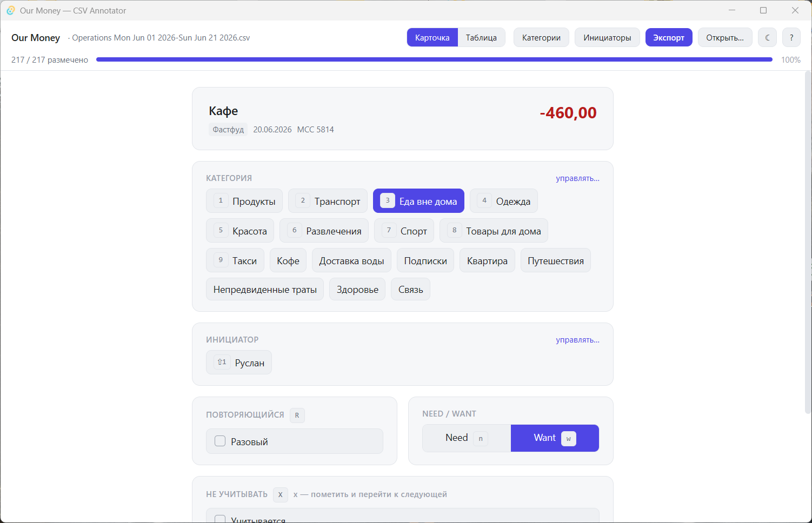

# Our Money — разметка выписок Т-Банка

[](LICENSE)
[](https://github.com/rusih100/our-money/releases/latest)
[](https://github.com/rusih100/our-money/releases)
[](https://github.com/rusih100/our-money/releases/latest)
[](https://tauri.app)
[](https://react.dev)
[](https://www.rust-lang.org)

Полированное, **«клавиатура-first»** десктоп-приложение для ручной разметки
банковских CSV-выписок. Загружаете экспорт, быстро классифицируете каждую
транзакцию хоткеями и выгружаете обогащённый CSV с новыми колонками.

> **⚠️ Только выписки Т-Банка.** Приложение рассчитано на формат CSV-экспорта
> **Т-Банка** (набор колонок, разделитель `;`, десятичная запятая, кодировка
> Windows-1251/UTF-8). Выписки других банков не поддерживаются — структура
> колонок не совпадёт.

Никакого облака, БД, авторизации или сети — **только локальные файлы**.



---

## Скачать

Готовые сборки под **Windows** — на странице
**[Releases](https://github.com/rusih100/our-money/releases/latest)**:

- **`Our Money_x.y.z_x64-setup.exe`** — установщик (NSIS), рекомендуется.
- **`Our Money_x.y.z_x64_en-US.msi`** — установщик MSI (альтернатива).

WebView2 Runtime предустановлен в Windows 11; на Windows 10 установщик подтянет
его при необходимости. Сборки не подписаны — SmartScreen может предупредить при
первом запуске («Подробнее» → «Выполнить в любом случае»).

---

## Возможности

- **Фокус-режим** — карточка одной транзакции: сумма с цветовой кодировкой
  (красный расход / зелёный доход), описание, банковская категория, дата, MCC.
- **Разметка хоткеями** — категория (`1`–`9`) и инициатор (`⇧1`–`⇧9`) по позиции,
  recurring, need/want, исключение из учёта, заметка. Мышь полностью опциональна.
- **Таблица/обзор** — виртуализированный список (300+ строк плавно) с фильтрами
  и живой аналитической сводкой (need/want, повторяемость, категории, инициаторы,
  исключённые).
- **Управляемые списки** категорий и инициаторов — добавление/переименование/
  сортировка/удаление; порядок задаёт хоткеи. Общие между всеми файлами,
  категории сидятся из существующих категорий выписки.
- **Автосохранение прогресса** — привязано к файлу, возобновляет ровно с того
  места, где остановились.
- **Экспорт** — новый CSV с тем же разделителем/кодировкой + 6 новых колонок.
  Исходный файл никогда не перезаписывается.

---

## Горячие клавиши

| Клавиша | Действие |
|---|---|
| `j` / `↓` | следующая транзакция |
| `k` / `↑` | предыдущая транзакция |
| `1`…`9` | назначить категорию по её позиции в списке |
| `⇧1`…`⇧9` | назначить инициатора по его позиции в списке |
| `r` | переключить «повторяющийся» (is_recurring) |
| `n` | пометить **need** |
| `w` | пометить **want** |
| `x` | «не учитывать» (excluded) и перейти к следующей |
| `c` | фокус на поле заметки (`Esc` — назад в режим клавиш) |
| `Enter` | подтвердить строку и перейти к следующей (annotated = true) |
| `u` | отменить последнее действие разметки |
| `/` | поиск/фильтр по описанию |
| `g` `g` | перейти к первой неразмеченной строке |
| `?` | показать/скрыть шпаргалку клавиш |
| `Ctrl`+`S` | экспорт CSV |

> **Важно:** пока курсор находится в текстовом поле (заметка/поиск), хоткеи не
> срабатывают — печатается обычный текст. `Esc` возвращает в режим клавиш.

---

## Схема аннотаций

На экспорте к каждой строке добавляются **6 новых колонок** (оригинальные
колонки не меняются и идут первыми):

| Колонка | Тип | Описание |
|---|---|---|
| `true_category` | строка | категория, назначенная пользователем из управляемого списка |
| `initiator` | строка | инициатор траты (имя из управляемого списка) |
| `is_recurring` | bool (`true`/`false`) | повторяющийся платёж или разовый |
| `need_want` | enum: `need` \| `want` | классификация траты |
| `note` | строка | свободная заметка (опционально) |
| `annotated` | bool (`true`/`false`) | строка была размечена (для прогресса и резюме) |

Плюс флаг **`excluded`** («не учитывать»): отдельной колонкой в экспорт **не**
выводится — такие строки целиком пропускаются. Исключённые строки считаются
размеченными (двигают прогресс).

---

## Формат входных данных

CSV-экспорт **Т-Банка**: разделитель `;`, десятичная запятая (`,`), поля в
двойных кавычках, кодировка **Windows-1251 или UTF-8** (определяется автоматически
в Rust-ядре через `encoding_rs`).

Приоритетные поля для отображения: `Описание`, `Сумма платежа`, `Категория`,
`Дата платежа` (с корректным fallback, если колонка отсутствует). Битые строки
пропускаются со счётчиком-предупреждением, без падения. Суммы парсятся с учётом
запятой-разделителя и неразрывных пробелов / разделителей тысяч.

---

## Где хранятся данные

В каталоге app-data ОС (на Windows — `%APPDATA%\com.ourmoney.annotator\`):

- `categories.json` — список категорий (между сессиями, общий для всех файлов).
- `initiators.json` — список инициаторов (аналогично).
- `progress/<ключ>.json` — прогресс разметки по каждому файлу.

Сам датасет не переоткрывается автоматически — выписку надо подгрузить заново,
после чего подтягиваются прогресс, категории и инициаторы.

---

## Сборка из исходников

### Требования

| Компонент | Назначение |
|---|---|
| [Rust](https://rustup.rs) (stable) | ядро Tauri |
| [Node.js](https://nodejs.org) LTS + npm | фронтенд |
| MSVC C++ Build Tools (Visual Studio) | компиляция под Windows |
| WebView2 Runtime | рендеринг UI (предустановлен в Windows 11) |

### Команды

```bash
npm install                          # зависимости
npm run tauri dev                    # dev-режим (нативное окно, HMR)
npm run tauri build -- --no-bundle   # standalone .exe (release, без установщика)
npm run tauri build                  # полная сборка с установщиками (NSIS/MSI)
npx tsc --noEmit                     # быстрая проверка типов фронтенда
```

### Стек

**Tauri 2** (ядро на Rust) + **React 19 + TypeScript + Vite 7**, стилизация —
**Tailwind CSS v4**, состояние — **Zustand**, парсинг CSV — **PapaParse**,
виртуализация — **@tanstack/react-virtual**, кодировки — **encoding_rs**.

---

## Релизы

Сборки публикуются автоматически через GitHub Actions
([`.github/workflows/release.yml`](.github/workflows/release.yml)) при пуше
тега. Чтобы выпустить новую версию:

1. Поднять версию в трёх местах: `package.json`, `src-tauri/tauri.conf.json`,
   `src-tauri/Cargo.toml`.
2. Обновить [`CHANGELOG.md`](CHANGELOG.md).
3. Закоммитить, поставить тег и запушить:
   ```bash
   git tag v0.1.0
   git push origin v0.1.0
   ```
4. Workflow соберёт приложение и создаст GitHub Release с прикреплёнными
   `.exe`/`.msi`.

---

## Архитектура

```
src/
  types.ts            доменные типы (без any)
  store.ts            Zustand store: датасет, навигация, undo, категории, инициаторы
  hooks/useHotkeys.ts глобальные хоткеи (с гейтингом по фокусу полей)
  lib/
    csv.ts            парсинг, разбор сумм, сериализация экспорта
    storage.ts        персистентность в app-data
    actions.ts        загрузка/экспорт (диалоги + Rust-команды)
    format.ts         форматирование сумм и дат
  components/         EmptyState, TopBar, FocusedView, ListView, SummaryPanel,
                      ManagedListPanel, CategoryPanel, InitiatorPanel,
                      HelpOverlay, Toast
src-tauri/
  src/lib.rs          команды read_csv / write_csv (encoding_rs)
```

---

## Лицензия

[MIT](LICENSE) © 2026 Rusih100
